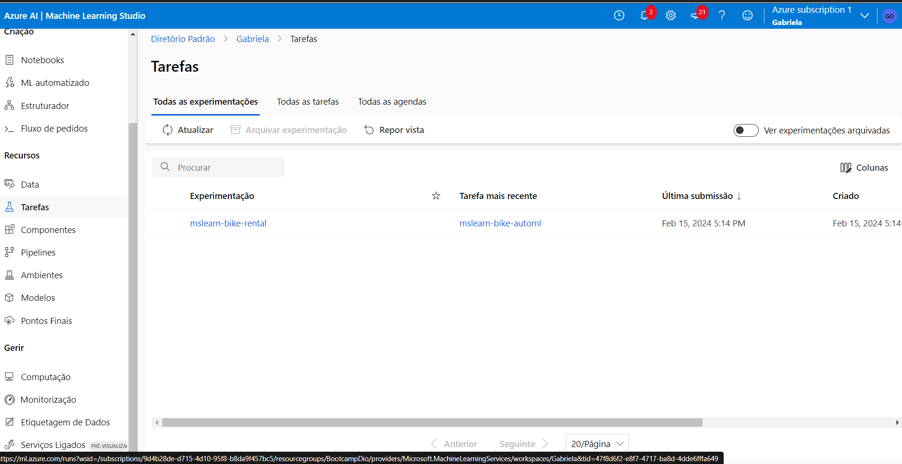

Trabalhando com Machine Learning na Prática no Azure ML

1. Crie um novo repositório no github com um nome a sua preferência
2. Crie um modelo de previsão com seus devidos pontos de extremidade configurados
3. Escreva o passo a passo desse processo em um readme.md de como você chegou nessa etapa
4. Salve nesse repositório o readme.md e o arquivo .json de pontos de extremidade
5. Compartilhe conosco o link desse repositório através do botão 'entregar projeto'

Explore Azure AI Services: 
https://microsoftlearning.github.io/mslearn-ai-fundamentals/Instructions/Labs/02-content-safety.html

Explore Automated Machine Learning in Azure Machine Learning:
https://microsoftlearning.github.io/mslearn-ai-fundamentals/Instructions/Labs/01-machine-learning.html

Avalie o melhor modelo
Quando o trabalho automatizado de aprendizado de máquina for concluído, você poderá revisar o melhor modelo treinado.

Na guia Visão geral do trabalho automatizado de aprendizado de máquina, observe o melhor resumo do modelo. Captura de tela do melhor resumo do modelo do trabalho automatizado de aprendizado de máquina com uma caixa ao redor do nome do algoritmo.

Observação Você poderá ver uma mensagem com o status “Aviso: pontuação de saída especificada pelo usuário alcançada…”. Esta é uma mensagem esperada. Continue para a próxima etapa.

Selecione o texto em Nome do algoritmo do melhor modelo para visualizar seus detalhes.

Selecione a guia Métricas e selecione os gráficos residuais e predito_true se eles ainda não estiverem selecionados.

Revise os gráficos que mostram o desempenho do modelo. O gráfico de resíduos mostra os resíduos (as diferenças entre os valores previstos e reais) como um histograma. O gráfico predito_true compara os valores previstos com os valores verdadeiros.

Implantar e testar o modelo
Na guia Modelo do melhor modelo treinado pelo seu trabalho automatizado de machine learning, selecione Implantar e use a opção de serviço Web para implantar o modelo com as seguintes configurações:
Nome : prever-aluguéis
Descrição : Prever aluguel de bicicletas
Tipo de computação : Instância de Contêiner do Azure
Habilitar autenticação : selecionado
Aguarde o início da implantação – isso pode levar alguns segundos. O status de implantação do endpoint de previsão de aluguel será indicado na parte principal da página como Running .
Aguarde até que o status da implantação mude para Succeeded . Isso pode levar de 5 a 10 minutos.
Testar o serviço implantado
Agora você pode testar seu serviço implantado.

No estúdio Azure Machine Learning, no menu esquerdo, selecione Endpoints e abra o ponto final em tempo real de previsão de alugueres .

Na página do endpoint em tempo real de previsão de aluguel, visualize a guia Teste .

No painel Dados de entrada para testar o endpoint , substitua o modelo JSON pelos seguintes dados de entrada:

Código
 {
   "Inputs": { 
     "data": [
       {
         "day": 1,
         "mnth": 1,   
         "year": 2022,
         "season": 2,
         "holiday": 0,
         "weekday": 1,
         "workingday": 1,
         "weathersit": 2, 
         "temp": 0.3, 
         "atemp": 0.3,
         "hum": 0.3,
         "windspeed": 0.3 
       }
     ]    
   },   
   "GlobalParameters": 1.0
 }
Clique no botão Testar .

Revise os resultados do teste, que incluem um número previsto de aluguéis com base nos recursos de entrada - semelhante a este:

Código
 {
   "Results": [
     444.27799000000000
   ]
 }
O painel de teste pegou os dados de entrada e usou o modelo treinado para retornar o número previsto de aluguéis.

