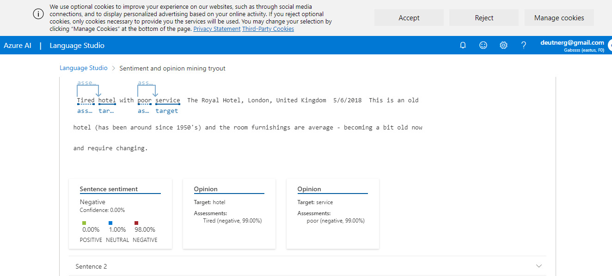

<h3> Análise de Sentimentos com Language Studio no Azure AI </h3>

Criar um recurso de fala do Azure AI

Em outra guia do navegador, abra o Azure AI Speech Studio , entrando com sua conta da Microsoft.
https://speech.microsoft.com/

Selecione Configurações e depois Crie um recurso. Configure-o com as seguintes configurações:
Nome do novo recurso : Insira um nome exclusivo .
Assinatura : sua assinatura do Azure .
Região : Selecione uma região suportada .
Nível de preços : FO gratuito (se disponível, caso contrário, selecione Standard S0).
Grupo de recursos : Selecione ou crie um grupo de recursos com um nome exclusivo .
Selecione Criar recurso. Aguarde até que o recurso seja criado e selecione Usar recurso . A página Introdução à Fala é exibida.

Selecione https://aka.ms/mslearn-speech-files para baixar o speech.zip . Abra a pasta.

Na página Introdução à fala, em Fala para texto, localize Fala em tempo real para texto . Selecione Experimente a fala em tempo real para texto .

O serviço Speech transcreve e exibe o texto em tempo real. Se você tiver áudio em seu computador, poderá ouvir a gravação enquanto o texto é transcrito.

https://microsoftlearning.github.io/mslearn-ai-fundamentals/Instructions/Labs/09-speech.html

<h3> Analise texto com Language Studio </h3>

Crie um recurso de idioma
Você pode usar muitos recursos do Azure AI Language com um recurso de idioma ou de serviços do Azure AI . Existem alguns casos em que apenas um recurso Idioma pode ser usado. Para o exercício abaixo, utilizaremos um recurso Linguagem . Se ainda não o fez, crie um recurso de idioma na sua assinatura do Azure.

Em outra guia do navegador, abra o portal do Azure em https://portal.azure.com , entrando com a conta da Microsoft associada à sua assinatura do Azure.

Clique no botão ＋Criar um recurso e pesquise Serviço de idioma . Selecione criar um plano de serviço de idiomas . Você será levado a uma página para selecionar recursos adicionais . Mantenha a seleção padrão e clique em Continuar para criar seu recurso .

Na página Criar Idioma , configure-o com as seguintes configurações:
Assinatura : sua assinatura do Azure .
Grupo de recursos : Selecione ou crie um grupo de recursos com um nome exclusivo .
Região : Leste dos EUA.
Nome : Insira um nome exclusivo .
Nível de preços : F0 grátis ou S se F0 grátis não estiver disponível
Ao marcar esta caixa, confirmo que li e compreendi todos os termos abaixo : Selecionado .
Selecione Revisar + criar e depois Criar e aguarde a conclusão da implantação.

Configure seu recurso no Azure AI Language Studio
Em outra guia do navegador, abra o Language Studio em https://language.cognitive.azure.com e entre.

Quando solicitado com Select an Azure resource , faça as seguintes configurações:

Diretório do Azure : diretório padrão, o diretório que você está usando
Assinatura do Azure : selecione a assinatura que você está usando
Tipo de recurso : Idioma
Nome do recurso : selecione o recurso de serviço de idioma que você acabou de criar
Em seguida, selecione Concluído .

Analise avaliações no Language Studio
Num navegador web, navegue até Language Studio em https://language.cognitive.azure.com .

Na página inicial Bem-vindo ao Language Studio , selecione a guia Classificar texto e, em seguida, selecione o bloco Analisar sentimento e extrair opiniões .

Em Selecionar idioma do texto , selecione Inglês .

Em Selecione seu recurso do Azure , selecione seu recurso.

Em Digite seu próprio texto, carregue um arquivo ou use um de nossos textos de exemplo , copie e cole a seguinte revisão:

 Tired hotel with poor service
 The Royal Hotel, London, United Kingdom
 5/6/2018
 This is an old hotel (has been around since 1950's) and the room furnishings are average - becoming a bit old now and require changing. The internet didn't work and had to come to one of their office rooms to check in for my flight home. The website says it's close to the British Museum, but it's too far to walk.

 Marque a caixa para confirmar que a demonstração incorrerá em uso e poderá gerar custos e selecione Executar .

Revise a saída. Observe que o documento é analisado quanto ao sentimento, assim como cada frase . Selecione Frase 1 para mostrar a análise de sentimento dessa frase.

Observe que há um sentimento geral seguido por pontuações próximas a três categorias: pontuação positiva , pontuação neutra e pontuação negativa . Em cada uma das categorias é atribuída uma pontuação entre 0 e 1. Essas pontuações de confiança indicam a probabilidade do texto fornecido ser um sentimento específico.

Selecione a frase 1 novamente para fechar.

Role para cima para selecionar Limpar caixa de texto e copie e cole a seguinte revisão:

 Good Hotel and staff
 The Royal Hotel, London, UK
 3/2/2018
 Clean rooms, good service, great location near Buckingham Palace and Westminster Abbey, and so on. We thoroughly enjoyed our stay. The courtyard is very peaceful and we went to a restaurant which is part of the same group and is Indian ( West coast so plenty of fish) with a Michelin Star. We had the taster menu which was fabulous. The rooms were very well appointed with a kitchen, lounge, bedroom and enormous bathroom. Thoroughly recommended.

 Selecione Executar . Revise o resultado e o sentimento e o nível de confiança.

Selecione Limpar caixa de texto novamente e copie e cole a seguinte revisão:

Muito barulhento e os quartos são pequenos The Lombard Hotel, São Francisco, EUA 05/09/2018 O hotel está localizado na rua Lombard, que é uma rua muito movimentada de SEIS pistas, diretamente da Ponte Golden Gate. Tráfego desde o início da manhã até tarde da noite, especialmente nos finais de semana. O ruído não seria tão ruim se os quartos fossem melhor isolados, mas não são. Tive que colocar algodão nos ouvidos para conseguir dormir – estava cansado demais para aproveitar a cidade no dia seguinte. Os quartos são MINÚSCULOS. Escolhi o quarto porque tinha duas camas queen size – mas o quarto mal tinha espaço para acomodá-las. Com uma família de quatro pessoas na sala, era apertado. Com tudo isso dito, os quartos são limpos e eles fizeram um esforço para atualizá-los. O hotel fica no bairro de Marina, com muitos bons lugares para comer, a uma curta caminhada do Presidio. Pode ser um bom hotel para jovens adultos que ficam acordados até tarde com um orçamento limitado

Selecione Executar e analise o sentimento juntamente com o nível de confiança. Dê uma olhada no texto e compare-o com a análise de sentimento que o serviço retornou.

Neste exercício você usou o Language Studio para criar um novo recurso de idioma ou usar um recurso de idioma existente. Você habilitou o recurso em Configurações antes de experimentar o serviço de mineração de sentimento e opinião. Em seguida, você testou o serviço com três trechos de texto.

Limpar
Se não pretende fazer mais exercícios, exclua todos os recursos que não precisa mais. Isso evita acumular custos desnecessários.

Abra o portal do Azure em https://portal.azure.com e selecione o grupo de recursos que contém o recurso que você criou.
Selecione o recurso e selecione Excluir e depois Sim para confirmar. O recurso é então excluído.

https://microsoftlearning.github.io/mslearn-ai-fundamentals/Instructions/Labs/06-text-analysis.html