Criar um recurso

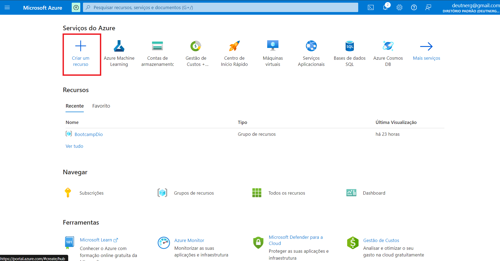

Selecionar AI + Machine Learning

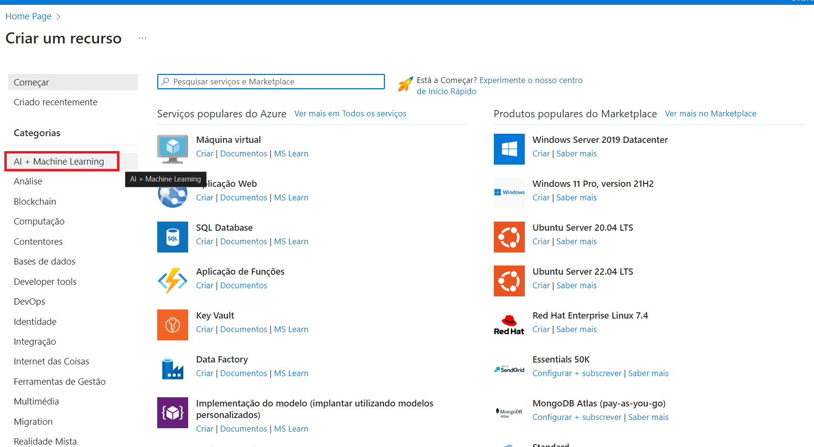

Criar um Serviço Cognotivo no Azure:

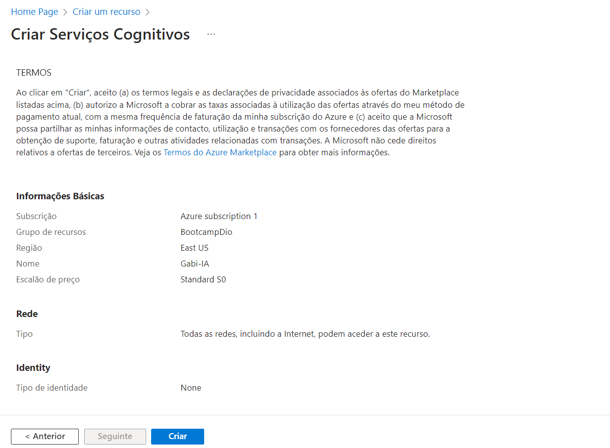

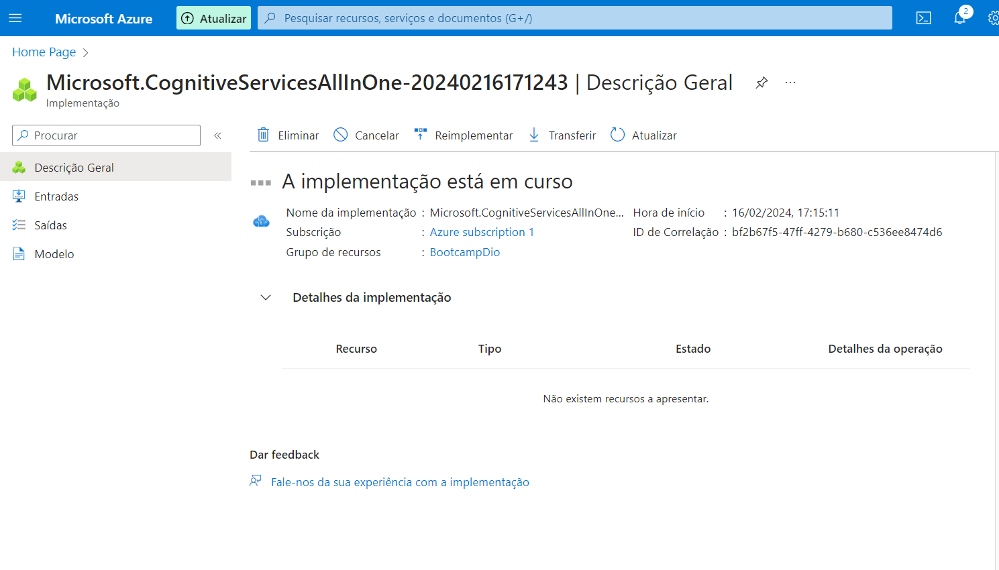

Acessar o portal do Vision Studio: https://portal.vision.cognitive.azure.com/

Clicar em view all resources

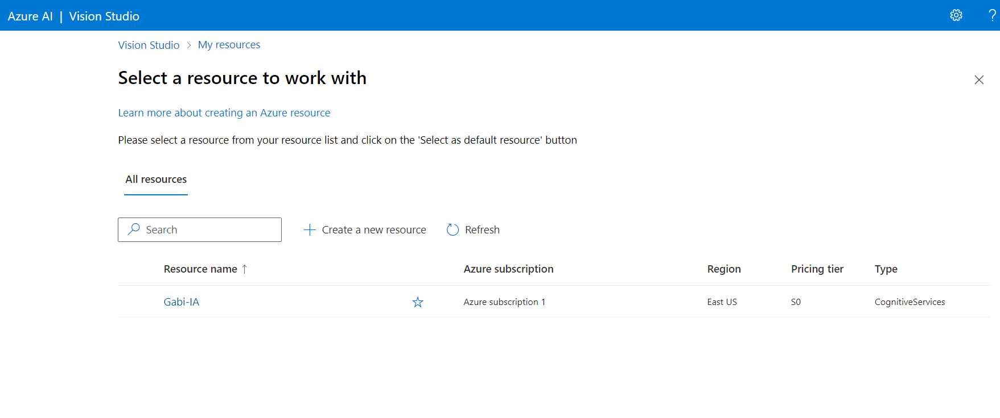

Colocar o recurso como default:

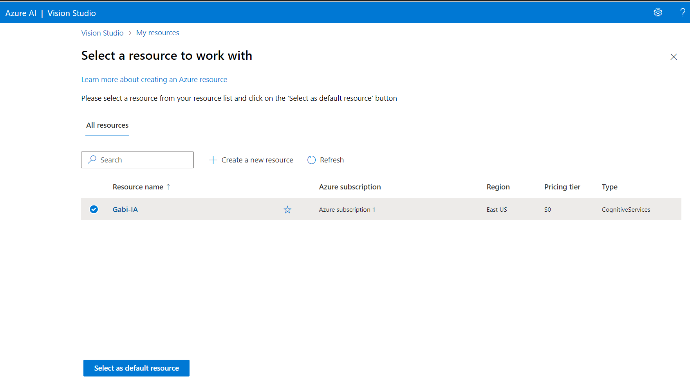

Ir em Home > Face > Detect Faces in an image:

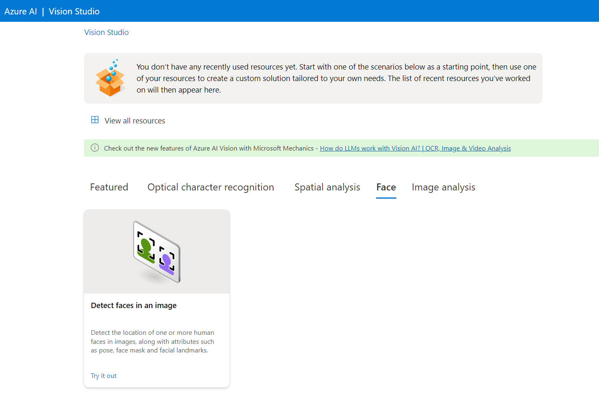

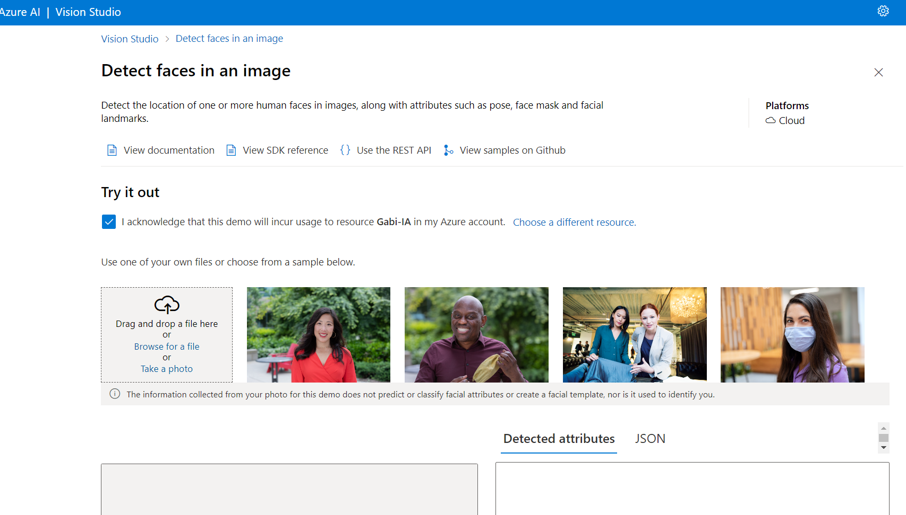

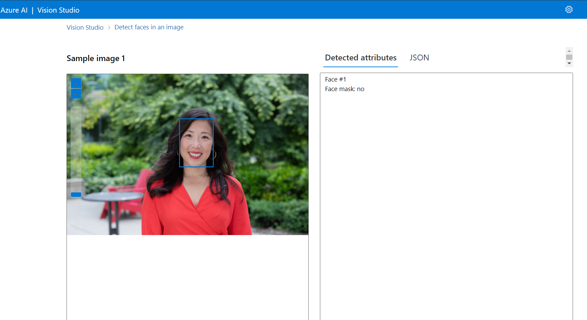

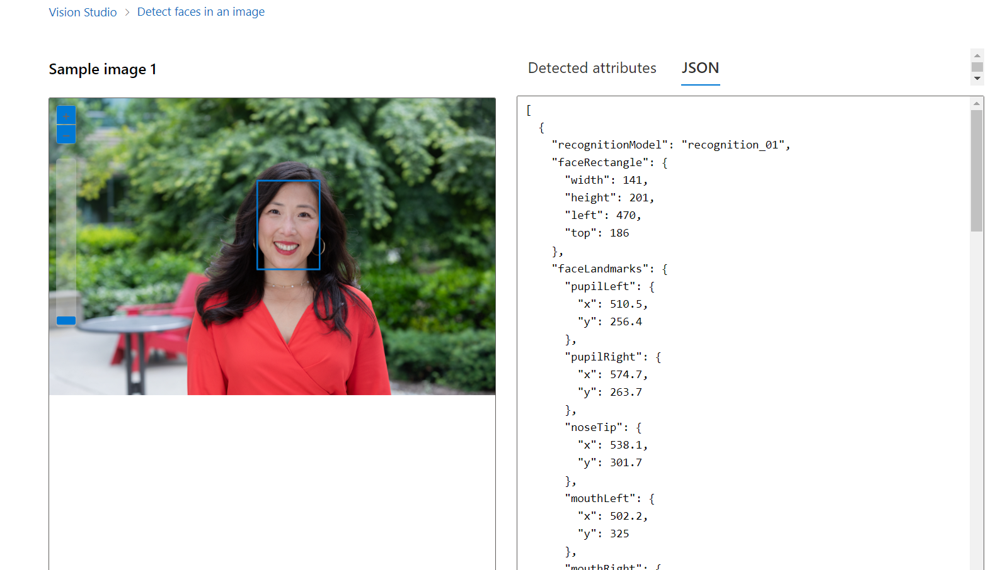

Depois ir em Optical Character Recognition > Extract Text from images

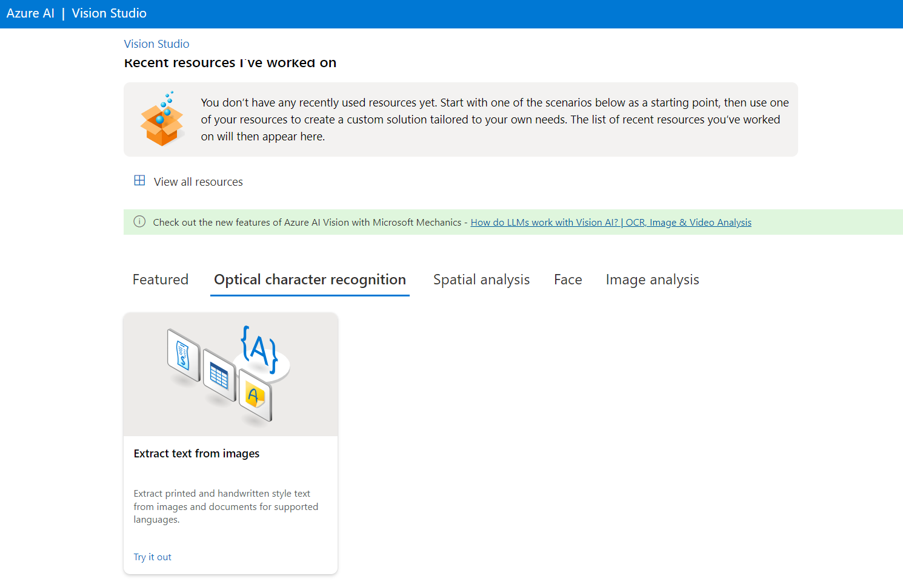

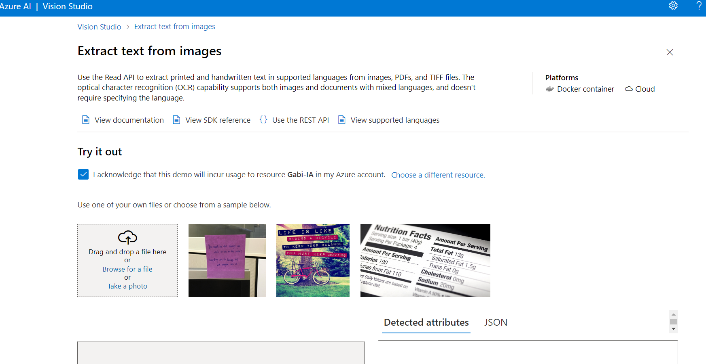

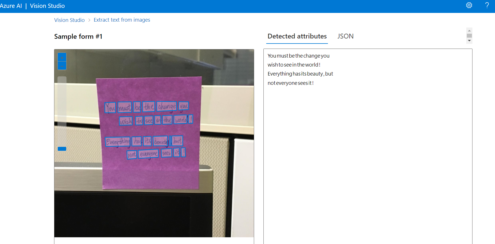

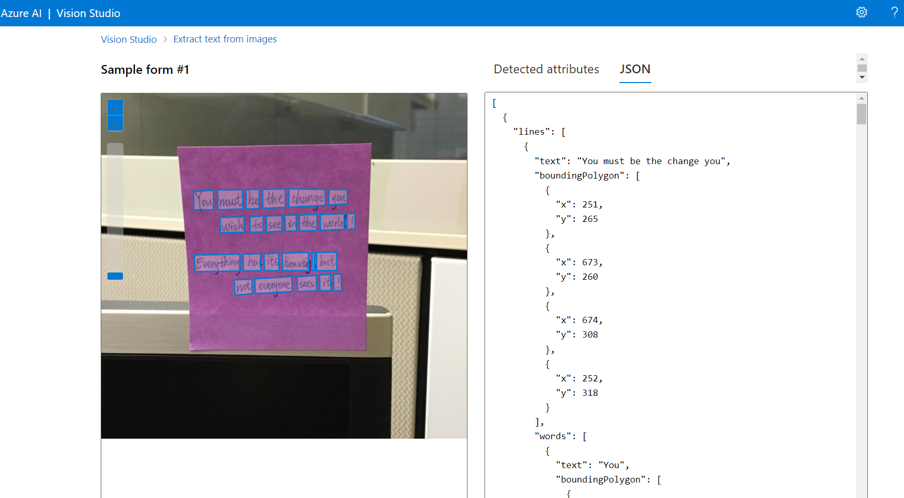

Depois ir em Image Analysis > Add captions to images

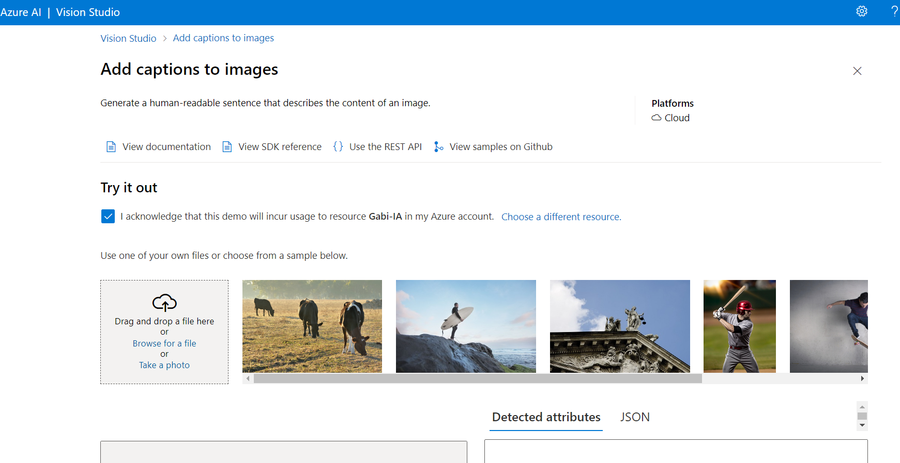

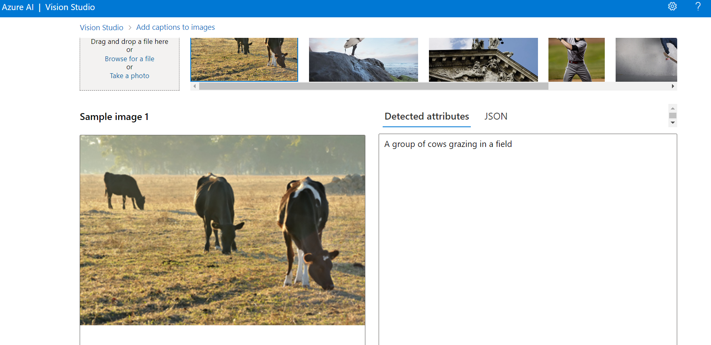

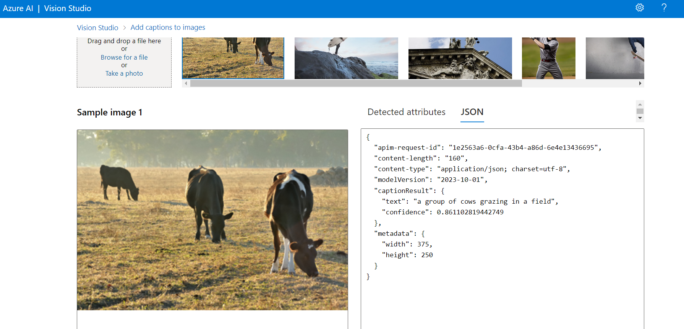

