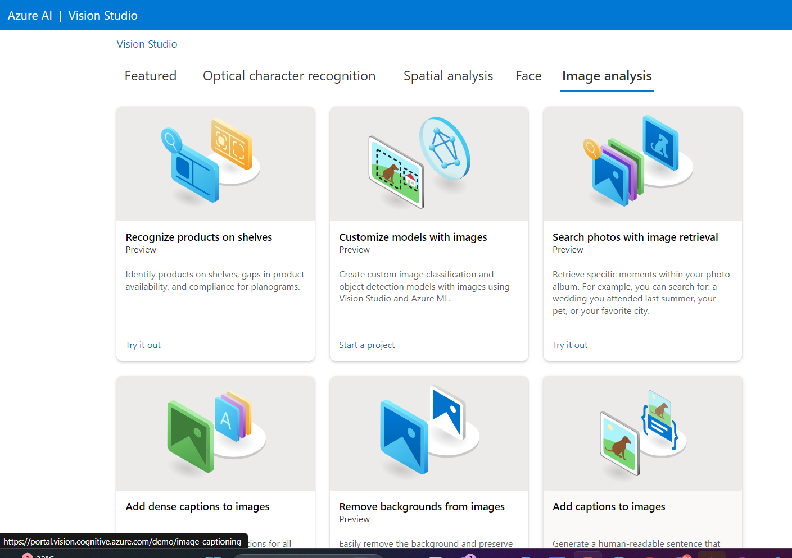

Criar um recurso

Selecionar AI + Machine Learning

Criar um Serviço Cognotivo no Azure:

Acessar o portal do Vision Studio: https://portal.vision.cognitive.azure.com/

Clicar em view all resources

Colocar o recurso como default:

Ir em Home > Face > Detect Faces in an image:

Depois ir em Optical Character Recognition > Extract Text from images

Depois ir em Image Analysis > Add captions to images

